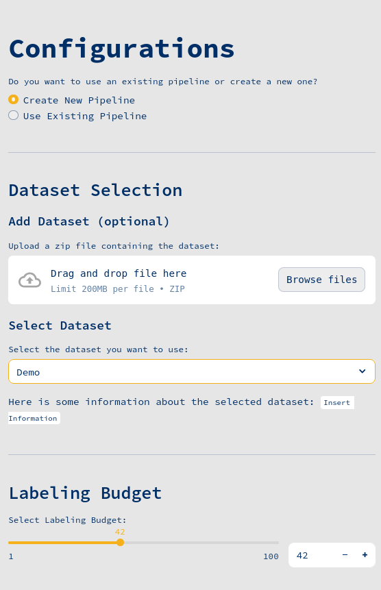
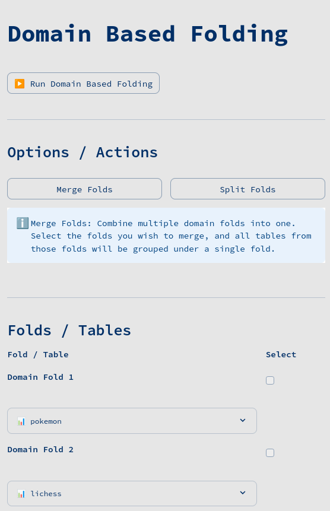
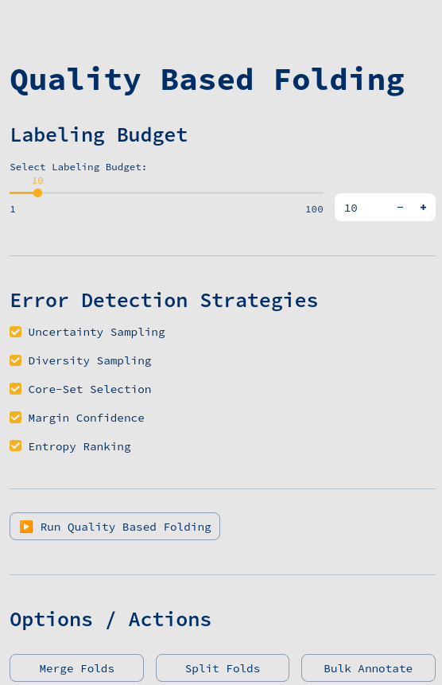
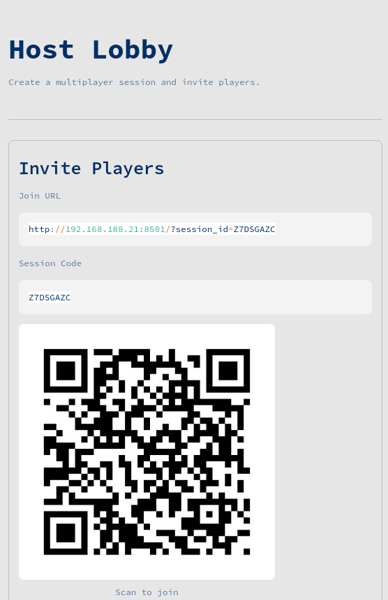
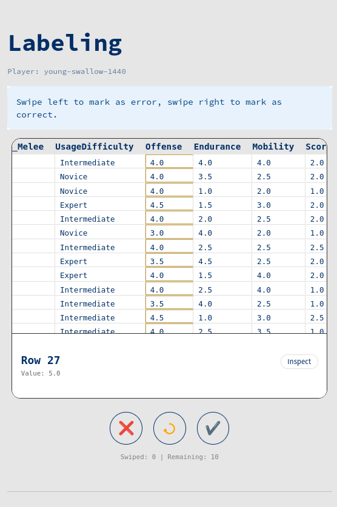
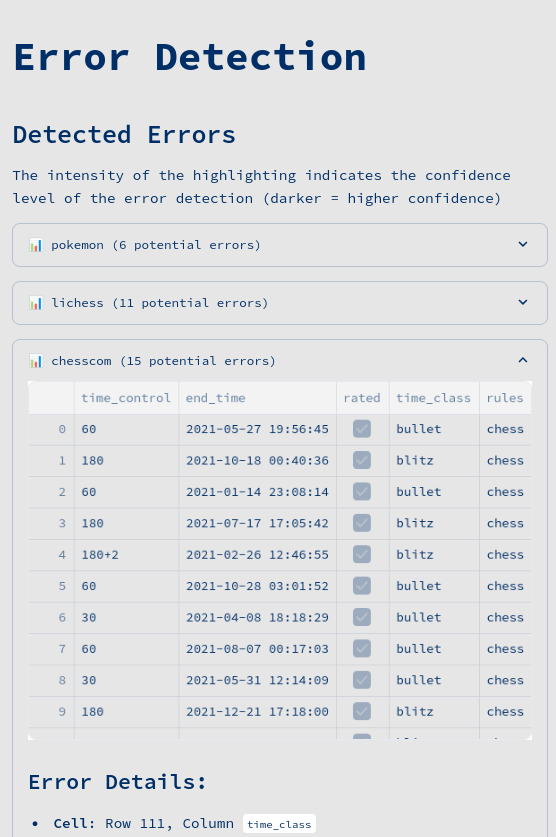
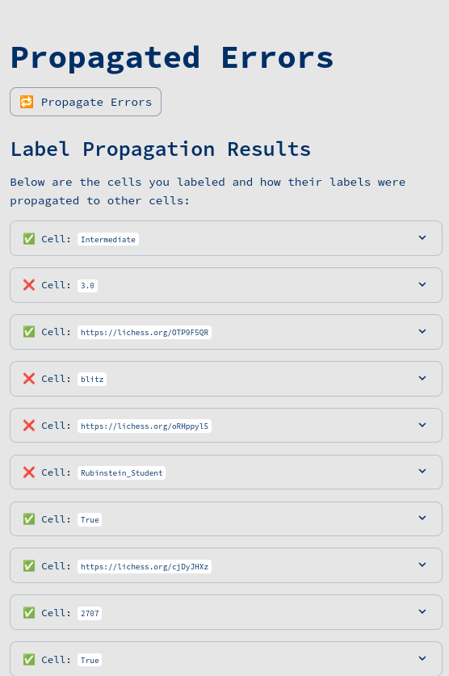
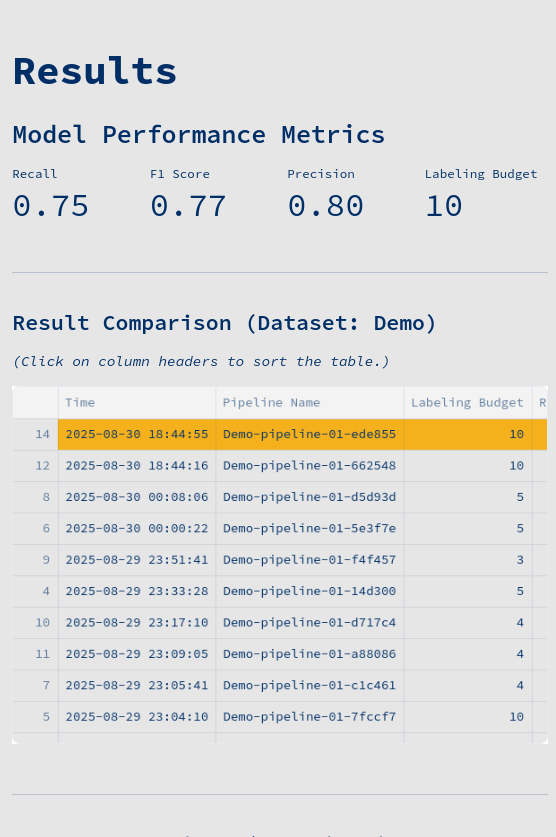

# Demonstrating Matelda for Multi-Table Error Detection

[](https://www.vldb.org/pvldb/vol18/p5379-ahmadi.pdf)
[](https://www.python.org/downloads/)
[](https://streamlit.io)
[](https://opensource.org/licenses/MIT)

Real-world datasets are often fragmented across multiple heterogeneous tables, managed by different teams or organizations. Ensuring data quality in such environments is challenging, as traditional error detection tools typically operate on isolated tables and overlook cross-table relationships. To address this gap, we investigate how cleaning multiple tables simultaneously, combined with structured user collaboration, can reduce annotation effort and enhance the effectiveness and efficiency of error detection.

We present Matelda, an interactive system for multi-table error detection that combines automated error detection with human-in-the-loop refinement. Matelda guides users through Inspection \& Action, allowing them to explore system-generated insights, refine decisions, and annotate data with contextual support. It organizes tables using domain-based and quality-based folding and leverages semi-supervised learning to propagate labels across related tables efficiently. Our demonstration showcases Matelda’s capabilities for collaborative error detection and resolution by leveraging shared knowledge, contextual similarity, and structured user interactions across multiple tables.

## Screenshots 


<!--  -->

<div align="center">
<table style="border-collapse: collapse; border-spacing: 0;">
<tr>
<td style="padding: 2px;"></td>
<td style="padding: 2px;"></td>
<td style="padding: 2px;"></td>
<td style="padding: 2px;"></td>
</tr>
<tr>
<td style="padding: 2px;"></td>
<td style="padding: 2px;"></td>
<td style="padding: 2px;"></td>
<td style="padding: 2px;"></td>
</tr>
</table>
</div>

## Video

Link to the Video: [Matelda Demo](videos/Matelda-Demo.mp4)

## Installation

```bash
git clone https://github.com/julianpaulussen/Matelda-Demo.git
cd Matelda-Demo
```

## Quick Start

### Prerequisites

Ensure you have Python 3.10+ installed on your system.

### Setup

1. **Create a virtual environment** (recommended)
   ```bash
   python -m venv venv
   source venv/bin/activate  # On MacOS/Linux
   venv\Scripts\activate     # On Windows
   ```

2. **Install dependencies**
   ```bash
   pip install -r requirements.txt
   ```

3. **Run the application**
   ```bash
   streamlit run app.py
   ```

4. **Open your browser** to `http://localhost:8501`

## Architecture

### Core Components

- **Backend**: Core data processing and ML algorithms (`backend/`)
- **Components**: Reusable UI components (`components/`)
- **Pages**: Application pages and workflows (`pages/`)
- **Pipelines**: Pre-configured processing pipelines (`pipelines/`)

## Development

```bash
# Clone the repository
git clone https://github.com/lejuliennn/data-tinder.git
cd data-tinder

# Install development dependencies
pip install -r requirements.txt

# Run in development mode
streamlit run app.py --server.runOnSave true
```

## Contributing

Contributions are welcome! Please feel free to submit a Pull Request. For major changes, please open an issue first to discuss what you would like to change.

1. Fork the repository
2. Create your feature branch (`git checkout -b feature/AmazingFeature`)
3. Commit your changes (`git commit -m 'Add some AmazingFeature'`)
4. Push to the branch (`git push origin feature/AmazingFeature`)
5. Open a Pull Request

## License

This project is licensed under the **MIT License** - see the [LICENSE](LICENSE) file for details.

## Support

- **Issues**: [GitHub Issues](https://github.com/julianpaulussen/Matelda-Demo/issues)
- **Discussions**: [GitHub Discussions](https://github.com/julianpaulussen/Matelda-Demo/discussions)

Thank you for choosing *Matelda for efficient data lake cleaning. We believe that this approach will significantly improve the quality of your data while saving you time and resources. Happy data cleaning!
